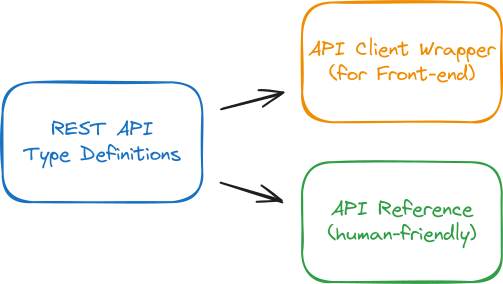

# REST API の型定義とドキュメンテーション

## すばる / su8ru

北大 B1 / HUIT

---

<!--
header: REST API の型定義とドキュメンテーション | su8ru
-->

# 自己紹介


## すばる / su8ru

- 北海道大学 総合教育部 1年
  (総合理系物理重点; 情エレ情理志望)
- HUIT
- 20 y.o.
- [su8ru.dev](https://su8ru.dev)

---

# 自己紹介


## すきなもの

- React
- TypeScript
- にじさんじ
- 飛行機 🔴

---

# いまから TypeScript の話をします

## 前提

**フロントエンド**の話です

1. 動的型付けである **JS に静的型検査を導入**します
2. ブラウザで動くのは JavaScript であり、**実行時は型検査が行われません**

## 実行しないと型が定まらない場合に問題となる
その**最たる例が REST API リクエスト**

---

## TypeScript を用いたフロントエンド実装での

# API クライアントの選択どうしてますか？

TypeScript の様々な「型の割れ窓」の中でも、
HTTP 通信や JSON 周りは特に厄介

---

<!-- # API クライアントの選択どうしてますか？ -->

## 一番簡単なのは `any` を握りつぶすこと:woozy_face: ：論外

安全にやろうとすると型ガードだらけで一番難しいかも

---

<!-- # API クライアントの選択どうしてますか？ -->

## 理想はフルスタック TypeScript:sparkles: だけど難しい


既存のサーバーがあるとか、安全性の問題とか……

→ 現実的には「**実装に合わせて型定義を作る**」方向で対処する

---

<!-- # API クライアントの選択どうしてますか？ -->

## OpenAPI はドキュメントとしても使えるけど大変


### バックエンドから自動生成

**型が弱い**、フロントエンドの**実装が遅れる**

### 人が手書き

書くのが**とても大変**

---

<!-- # API クライアントの選択どうしてますか？ -->

## コード生成ツールは書きやすく表現力も高いが


API 全体を**俯瞰するには不向き**

そもそもドキュメントを書くためのツールじゃない

---

`src/apis/reservations/search/index.ts`

```ts
export interface Methods {
  /**
   * 予約情報の検索
   *
   * @remarks
   * 必要な権限:
   * - reservation
   *
   * @throws Error
   * 400: 誤ったパラメータが含まれている
   *
   * @returns 検索条件をすべて満たした予約情報の配列
   * 該当するものがない場合は空の配列
   */
  get: {
    reqHeaders: AuthToken;
    query: Partial<ReservationQuery>;
    resBody: Reservation[];
  };
}
```

---

# 現状あまりいい方法がない

## → どうしよう

---

# REST API 型定義とリファレンスは本質的に同じ

どちらも API のリクエストやレスポンスの型を定義している

ただし、リファレンスには**認証情報や補足情報、エラーに関する情報**も含まれる

## → API 型定義からリファレンスを生成するのが最強では？？

---

# こんなツールを作りたい



---

## 📝 TS で定義することで型の表現力と書きやすさを両立

Utility Types も使えて嬉しい


## 📘 ソースコードで記述された定義を文書化

TypeDoc がかなり近いが、API ドキュメントとしては不適

## 💣 エラーもなるべく型付けして扱いたい

4xx 系列ならたぶん API 仕様内なので、型を付けてあげたい

---

# ご清聴ありがとうございました！

## 興味ある！とかこんな方法は？とかぜひ教えてください！
