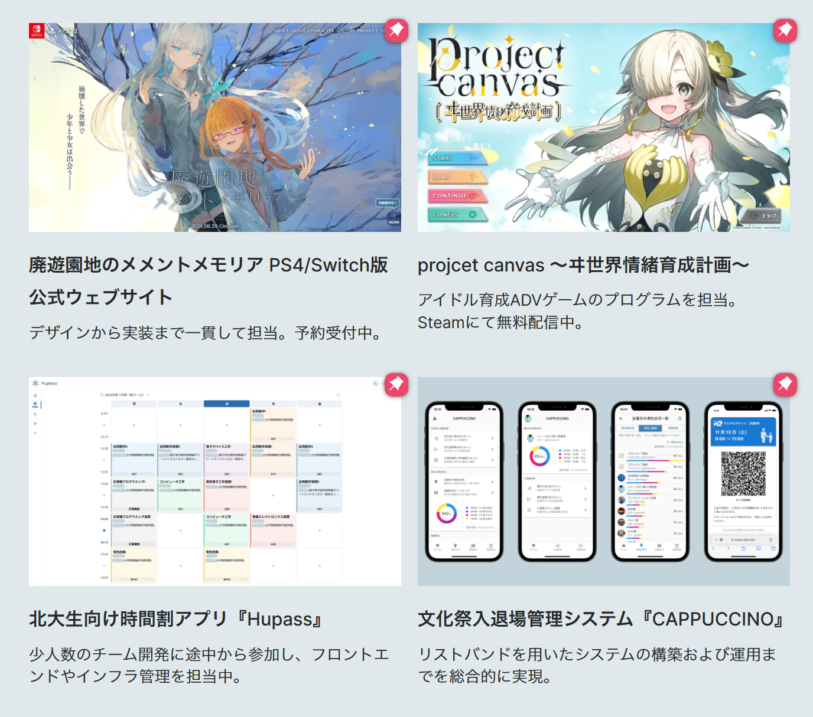
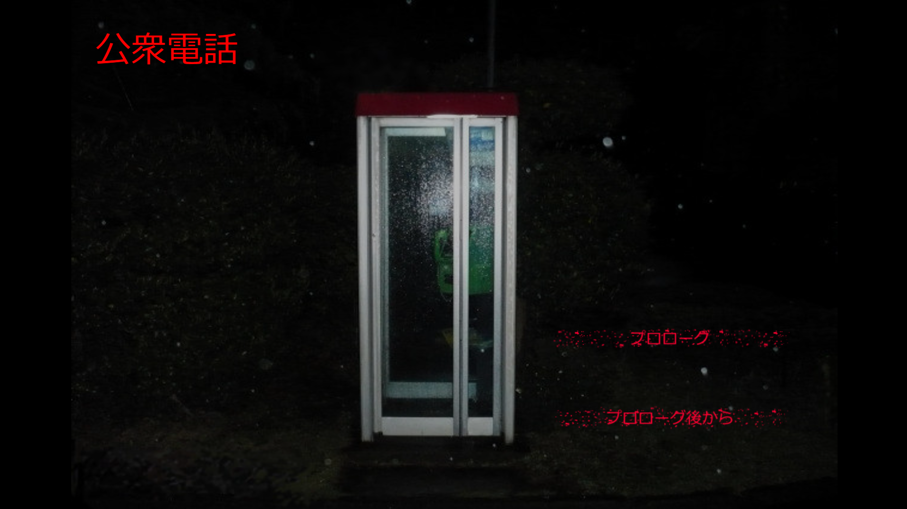
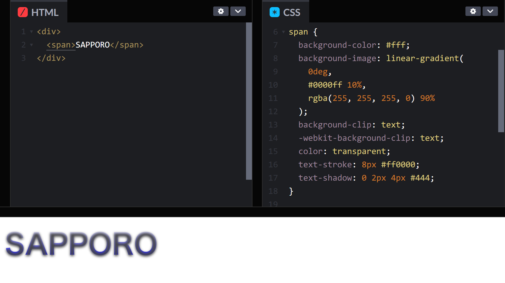
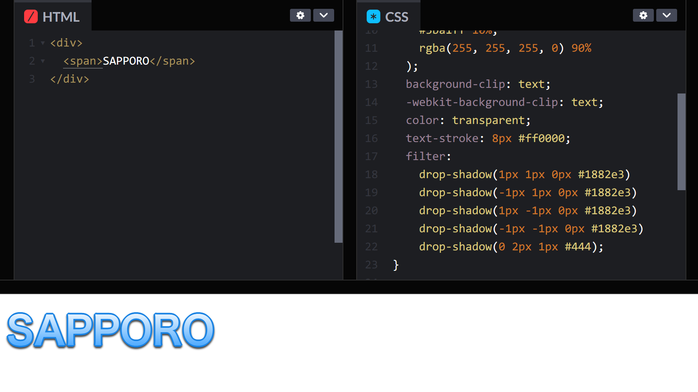
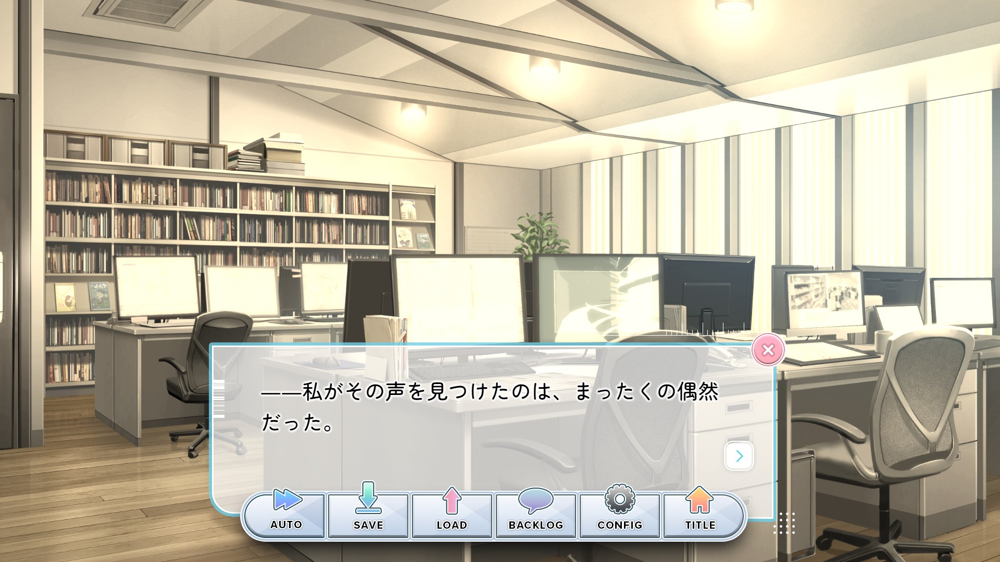

# ノベルゲームとしての Web フロントエンド

**すばる / su8ru**

2024-08-30 | SAPPORO ENGINEER BASE #03 | #seb_sapporo

[slides.su8.run/240830-seb03](https://slides.su8.run/240830-seb03)

---

<!--
header: ノベルゲームとしての Web フロントエンド | su8ru
-->

# 自己紹介


## すばる / su8ru

- 北海道大学工学部
  情報エレクトロニクス学科 2 年
- 北大 IT 研究会 HUIT
- Twitter: [@su8ru\__n_](https://twitter.com/su8ru_n)
  `@su8ru_` が凍結……フォローお願いします……
- GitHub: [@su8ru](https://github.com/su8ru)
- すきなもの
  - 初音ミク / にじさんじ / V.W.P
  - 飛行機 🔴

---

# 自己紹介



[su8ru.dev](https://su8ru.dev)

---

# 今日話すこと

- ティラノスクリプト：ノベルゲームエンジン
- これもまた Web フロントエンド
- いろいろな技術的困難が発生する
- CSS と JavaScript があればなんとかなる

---

# おことわり

- 私はノベルゲームや ADV ゲームについてほとんど無知です

---

# ティラノスクリプト


[https://tyrano.jp](https://tyrano.jp) →

---

## ティラノスクリプトとは

> HTML5 製アドベンチャーゲーム制作キット。
> テイラノスクリプトは KAG TGS(一部使用不可)と
> HTML CSS javascript(jQuery)によって
> 色々な変更がききます。

[ティラノスクリプト 製作テクニック wiki](https://tyrano.wiki.fc2.com/) より

---


---



---


---

## 具体的には

こんなかんじ（時間がないので、雰囲気だけ！）

```js
*start
[wait time=200]

吾輩わがはいは猫である。名前はまだ無い。[l][r]
どこで生れたかとんと見当けんとうがつかぬ。[l][cm]
何でも薄暗いじめじめした所でニャーニャー泣いていた事だけは記憶している。[l]
吾輩はここで始めて人間というものを見た。[l][r]
```

[チュートリアル](https://tyrano.jp/usage/tutorial/moji) より

---

## JavaScript も書ける

<!-- prettier-ignore -->
```js
[eval exp="f.flag1 = 1000"]

[eval exp="sf.変数その１ = '文字列'"]

[eval exp="tf.flag1 = f.flag2"]
```

<!-- prettier-ignore -->
```js
[iscript]

f.flag1 = 1000

sf.変数その１ = '文字列'

tf.flag1 = f.flag2

[endscript]
```

[チュートリアル](https://tyrano.jp/usage/tech/hensuu) より

---

# 技術的観点から見るティラノスクリプト

---

## ブラウザおよび Electron 上で動作する

ブラウザゲームだけでなく、多種多様な環境で動作

（Electron が動くところならどこでも動く、たぶん）

---

## 独自のコールスタッフを持っている

上から順にスタックに格納され、順次実行されていく

```js
*start
[wait time=200]

吾輩わがはいは猫である。名前はまだ無い。[l][r]
どこで生れたかとんと見当けんとうがつかぬ。[l][cm]
何でも薄暗いじめじめした所でニャーニャー泣いていた事だけは記憶している。[l]
吾輩はここで始めて人間というものを見た。[l][r]
```

（スタックの実態は `tyrano.plugin.kag.stat.stack` 以下にある）

---

## 独自のコールスタッフを持っている

`tyrano.plugin.kag.ftag.startTag(...)` で JavaScript からタグを呼べるものの、
条件によってはスタックが 2 つ進んでしまうことがある
↓
極力 JavaScript からタグを呼ばないようにしたい（つらみポイント）

<!-- prettier-ignore -->
```js
[iscript]
  tyrano.plugin.kag.ftag.startTag('hoge'); // ここで 1 回
[endscript] // ここで 1 回
```

---

## ややこしい！

→ ティラノスクリプトに固有の技術的困難にはあまり触れずにいきます

---

# 立ちはだかる技術的困難その 1

## background-clip と text-shadow

---

デザイン指示

## 「文字にグラデーションをかけつつ、縁取りと影を付けたい！」

---


---


---

## 一般的なアプローチ

1. 文字のグラデーション

- `background` に `linear-gradient` を敷いて、`background-clip: text;` を指定

2. 文字の縁取り

- `text-stroke` を使う or `text-shadow` を 4 方向指定

3. 文字に影を落とす

- `text-shadow`…？

---

## background-clip と text-stroke は併用できない

文字の境界線を基準に背景を切り抜いて表示しているので、
その文字に装飾はできない（無視される）

---

## じゃあ text-shadow か……と思ったら

---

## 

---

## `color: transparent;` としているので、影が透けてしまう！

text-shadow は background より上に描画されるんですね……

---

## 救世主：`filter: drop-shadow()`

> `drop-shadow()` は CSS の関数で、
> **入力画像**にドロップシャドウ効果を適用します。

[MDN](https://developer.mozilla.org/ja/docs/Web/CSS/filter-function/drop-shadow) より

→ なんかいけそう！

---

## 試みるアプローチ

1. 文字のグラデーション

- `background` に `linear-gradient` を敷いて、`background-clip: text;` を指定

2. 文字の縁取り

- **`filter: drop-shadow()` を 4 方向指定**

3. 文字に影を落とす

- **`filter: drop-shadow()`**

---



---

## できた！🎉

---

# 立ちはだかる技術的困難その 2

## エンジン内部に隠蔽されたイベントのフック

---


---



---

仕様要求

## 「キャラ名がないテキストのときは後ろの画像も消したい！」

---

## そもそもキャラ名表示の実装は…？

`[ptext name="chara-name"]` を用意して、`[chara_config ptext="chara-name"]` と
指定しているだけ

→ キャラ名の表示はエンジンが勝手にやっている

→ キャラ名が変更されたことを検知するのは難しい

---

## 救世主：MutationOvserver

> `MutationObserver` インターフェイスは、
> DOM ツリーへ変更が加えられたことを
> 監視することができる機能を提供します。

[MDN](https://developer.mozilla.org/ja/docs/Web/API/MutationObserver) より

---

## やってみる

```js
const target = document.getElementsByClassName('chara-name')[0];
const observer = new MutationObserver((mutations) => {
  mutations.map((mutation) => {
    const { type, target } = mutation;
    if (type === 'childList') {
      // target.innerText が変わってるかもしれない！
      // → 背景画像の表示切り替え処理（省略）
    }
  });
});
observer.observe(target, {
  childList: true, // ← これ忘れずに！
});
```

---

## できた！🎉

デモを用意してる時間がありませんでした…！

---

ご清聴ありがとうございました！

- スライド：[slides.su8.run/240830-seb03](https://slides.su8.run/240830-seb03)
- Twitter: [@su8ru_n](https://twitter.com/su8ru_n)
- かわいい名刺を作ったのでぜひもらってください
