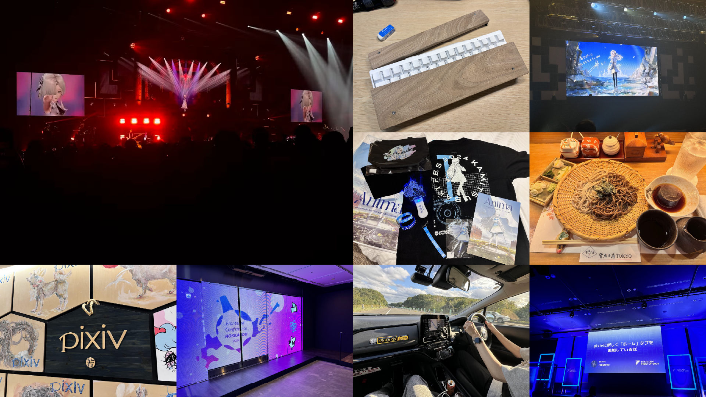
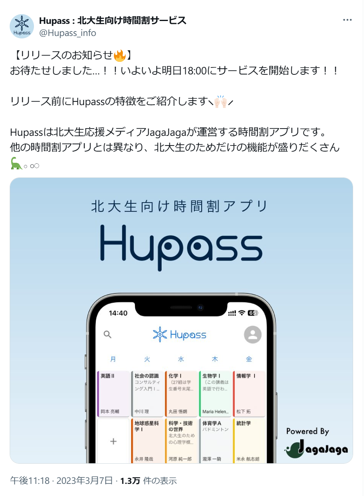
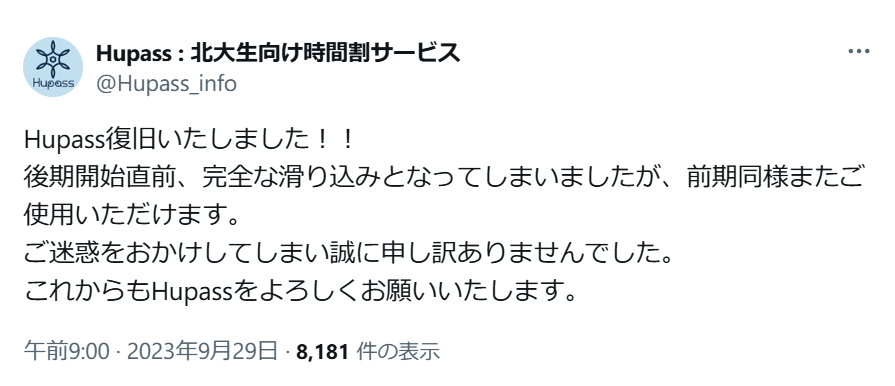
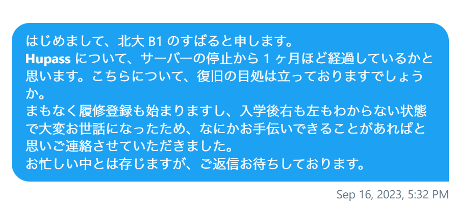

# 北大生向け時間割アプリ『Hupass』の   これまでとこれから

### すばる / su8ru

2024-10-04 | HUIT 夏休み明け LT 会

[slides.su8.run/241004-hupass](https://slides.su8.run/241004-hupass)

---

<!--
header: 北大生向け時間割アプリ『Hupass』のこれまでとこれから | su8ru
-->

# 自己紹介

## すばる / su8ru

- 北海道大学工学部
  情報エレクトロニクス学科 2 年
- HUIT / 3D 研 / **JagaJaga**
- Twitter: [@su8ru\__n_](https://twitter.com/su8ru_n)
- GitHub: [@su8ru](https://github.com/su8ru)
- すきなもの
  - 初音ミク / 鏑木ろこ / ヰ世界情緒
- 最近カンファレンス行くのにハマっています

---

---

# Hupass をご存知ですか？

---

## 

---

## 

---

北大のシラバスデータを元にした、

# 北大生の北大生による北大生のための時間割アプリ

---

# Hupass のこれまで

---

## 2023/3 - Hupass リリース

---

【メイカー特集 #1】北大生のために開発された北大生向け時間割サービス「Hupass」とは — 未完 Foundation | 一般社団法人未完
https://mikan-foundation.org/2023/04/makers-1/

---

## 2023/8 - 突然のサービス長期停止

当時の人々のツイート

> ちょっと前くらいから hupass が読み込めないけど、環境のおはなしなのかな

> HUpass 使えない

> HUpass 使えないからシラバスで頑張って探すしかない。

> Hupass 封印されてるのふつーにつらい

> 来年には Hupass が死語になってる説

### Q. iNAZO や JagaJaga は生きてる。じゃあなんで落ちてるんだ…？

---

## 2023/9 - 後期滑り込み復旧

---

## Hupass なしで新学期を迎えるなんて考えられない！

### → ぜひ協力してくれないかとのお返事

---

### Q. iNAZO や JagaJaga は生きてる。じゃあなんで落ちてたんだ…？

---

### A. 諸事情によりサーバーがストップしたあと、立ち上がらなくなった

当時の開発メンバーは学部 4 年生 x 2

夏休みも研究で忙しく、Hupass の復旧作業をしている余裕がなかった

#### → 開発体制の刷新と安定を目指すことに

---

# Hupass のこれから

---

## 開発体験の改善

status: 随時実施中（2023/10 ～）

- GitHub Actions と Docker を用いた CI/CD
- モノレポ化により並行開発を容易に

---

## サーバースペックアップ

status: 実施済み（2024/9）

**RAM**: 512 MB → **2 GB**

**CPU**: 1 コア → **3 コア**

---

## バックエンドの再実装

status: これから（2025/3 目標）

夏休みは主にこれに取り組んでいました

### Django (Python) → Echo (Go)

- モデルの再設計
- スキーマ駆動開発？
- テストの導入

---

# 開発メンバー募集中！！

Hupass はまだまだやることたくさん

ユーザーからの要望もたくさん

---

## ご清聴ありがとうございました

YAPC::Hakodate 行ってきます！:airplane:
