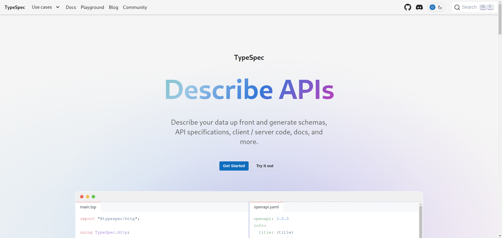
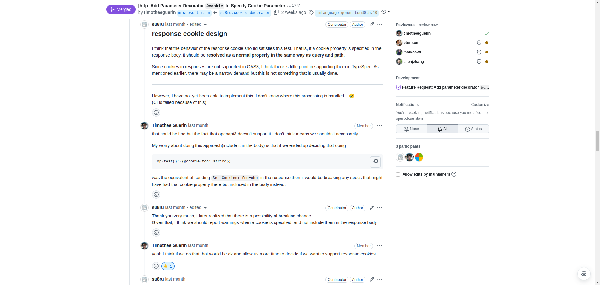
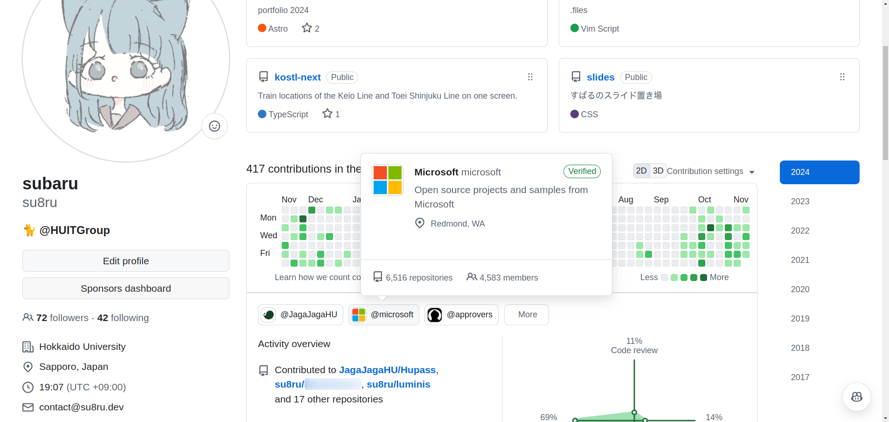

# OSS にデカめの貢献してみた

### すばる / su8ru

2024-11-15 | HUIT JPHACKS 振り返り・LT 会

<https://slides.su8.run/241115-typespec>

---

<!--
header: OSS にデカめの貢献してみた | su8ru
-->

# 自己紹介

## すばる / su8ru

- 北海道大学工学部
  情報エレクトロニクス学科 2 年
- HUIT / 3D 研 / JagaJaga (Hupass)
- Twitter: [@su8ru\__n_](https://twitter.com/su8ru_n)
- GitHub: [@su8ru](https://github.com/su8ru)
- すきなもの
  - 初音ミク / 鏑木ろこ / ヰ世界情緒
- フロントエンドエンジニアですが最近は Go だらけ

---

# 『OSS』って知ってますか？

『オープンソースソフトウェア』の略語らしい

---

## 『オープンソースソフトウェア』

> オープンソースソフトウェア（英: Open Source Software、略称: OSS）とは、利用者の目的を問わずソースコードを使用、調査、再利用、修正、拡張、再配布が可能なソフトウェアの総称である。
>
> フリー百科事典『ウィキペディア（Wikipedia）』
> <https://ja.wikipedia.org/wiki/%E3%82%AA%E3%83%BC%E3%83%97%E3%83%B3%E3%82%BD%E3%83%BC%E3%82%B9%E3%82%BD%E3%83%95%E3%83%88%E3%82%A6%E3%82%A7%E3%82%A2>

---

# どういうこと？

---

## オープンソースソフトウェアは定義がいろいろ

→ ウィキペディアの説明はそれらをすべて内包する抽象的なもの

---

ここでは

## GitHub とかでみんなで作ってみんなで使えるソフトウェア

とします

（当然ですが、厳密な定義ではない）

---

## 発表を聞きながらメモした技術たち

- React
- TypeScript
- Vite
- Three.js

---

# これらは全部 OSS

---

## 『コントリビュート』という文化

英：contribute

→ 寄付する、貢献する

---

## 今回私が『貢献』したのは……

---

---

---

## 経緯

Hupass ではいまバックエンドの式年遷宮（作り直し）をしています

---

### アーキテクチャとしてスキーマ駆動を導入

TypeSpec（API 定義）
↓
OpenAPI
↓
oapi-codegen + Echo（バックエンド実装）

---

## contribute の流れ

1. repository を fork する
2. commit する
3. pull request を投げる
4. reviewer とがんばる +α

---

---

- 10/15 TypeSpec で Cookie をパラメータにできないことに気づく
  → Discussion で質問
- 10/15 「typespec/http ライブラリの "gap" だと思うよ」
  「気軽に feature request 立ててね」
  → Issue を立てる
- 10/16 なんかあんまりすぐ動く気配がない & すぐにほしい！
  → PR を立てる
- 10/17 Reviewer から最初のリアクションがくる
- 〜 指摘されたり考えたり 〜
- 11/1 Approve !!
- 11/2 Merged !!

---

## 指摘されたり考えたり？

---

## response で `@cookie` を指定されたときの挙動

パラメータではなく一般のプロパティにすることにした
（他の `@path` や `@query` と同様の挙動）

→ reviewer「将来的に `Set-Cookie` をサポートしたとき破壊的変更になるのでは？」

→ diagnostics（診断）を追加しそれを返すようにした（大変だった……）

---

---

## 学びを得た

- TypeSpec そのものへの理解がとても深まった
  → 実際に TypeSpec を使った開発に役立つ！
- デカ OSS は現在だけじゃなくて未来を見ながら仕様を決定してる
  → 姿勢が普段の開発の参考になる

---

