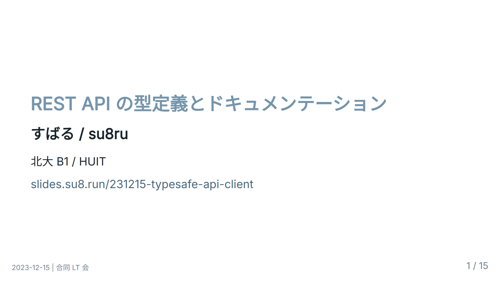
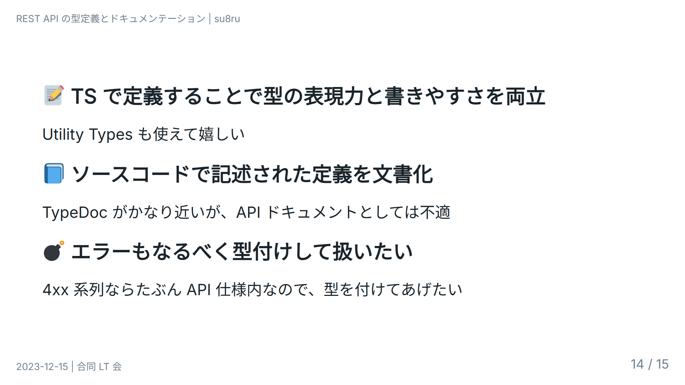
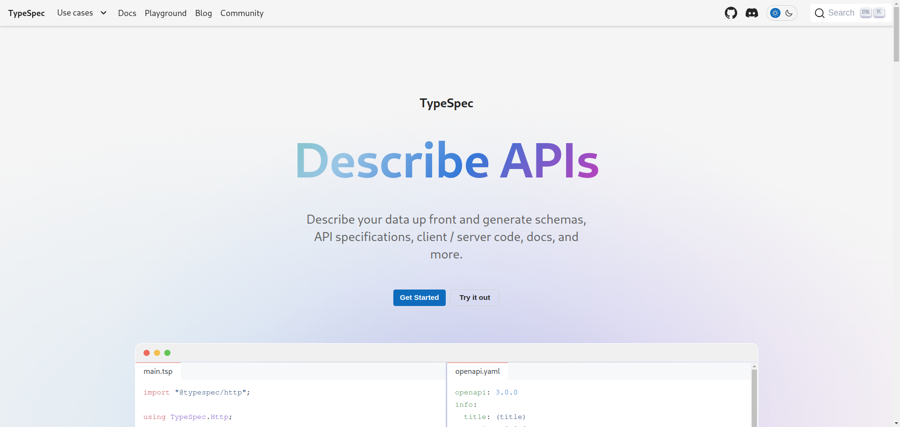
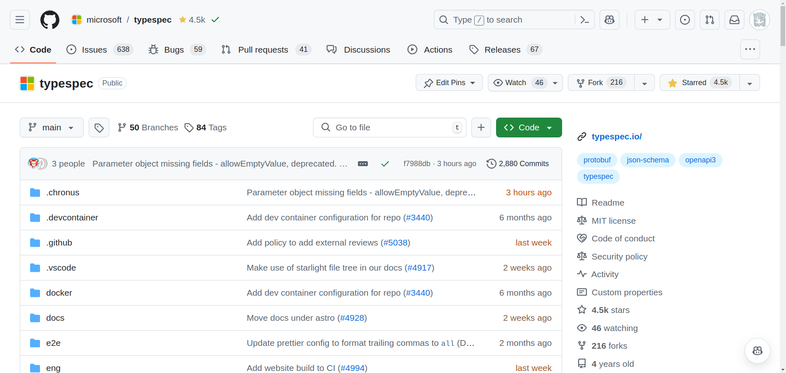
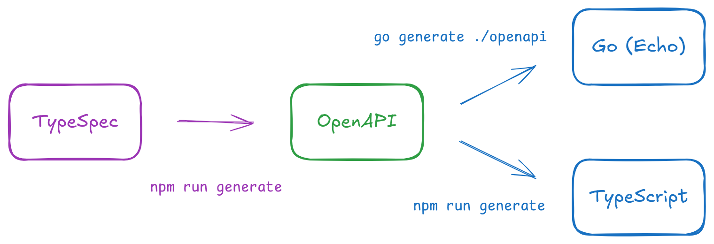
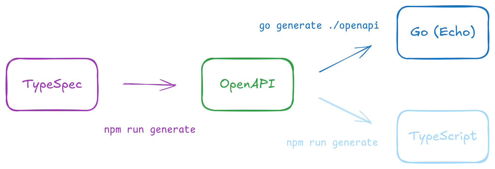

# REST API 型安全を目指して<br />〜スキーマ駆動開発を支える技術〜

<style scoped>
  .profile-icon {
    width: 90px;
    float: left;
    margin-right: 16px;
  }
</style>


### すばる / su8ru

<br />

2024-11-29 | 北大合同勉強会 2025 冬

<https://slides.su8.run/241129-schema-driven>


---

<!--
header: REST API 型安全を目指して 〜スキーマ駆動開発を支える技術〜 | su8ru
-->

<style scoped>
  .profile-icon {
    width: 400px;
    float: right;
    margin-right: -20px;
    margin-top: -20px;
  }
</style>


# 自己紹介

## すばる / su8ru

- 北海道大学工学部
  情報エレクトロニクス学科 2 年
- **HUIT** / 3D 研 / JagaJaga (Hupass)
- Twitter: [@su8ru\__n_](https://twitter.com/su8ru_n) <- New!!
- GitHub: [@su8ru](https://github.com/su8ru)
- すきなもの：TypeScript / 初音ミク / 鏑木ろこ / ヰ世界情緒
- お仕事でフロントエンドを、趣味でバックエンドを書いています

---


---



---

# 当時の概要

- 理想はフルスタック TypeScript だが難しい
  - 現実的には「実装に合わせて型定義を作る」方向で対処する
- OpenAPI はつらい
  - バックエンドから生成するとフロントエンドが遅れる
  - 手書きはとても大変
- API 型定義からリファレンスを生成したい

---



---

# 最強の API 定義用ライブラリを作ろう！

---

## と、思ったんですが……

---

## もうありました

---



---



---

## 実際に見てみる

---

```tsp
import "@typespec/http";

using TypeSpec.Http;

model Store {
  name: string;
  address: Address;
}

model Address {
  street: string;
  city: string;
}

@route("/stores")
interface Stores {
  list(@query filter: string): Store[];
  read(@path id: Store): Store;
}
```

---

## これを OpenAPI に変換すると……

```sh
tsp compile .
```

---

<div class="col2">

```yaml
openapi: 3.0.0
info:
  title: (title)
  version: 0.0.0
tags: []
paths:
  /stores:
    get:
      operationId: Stores_list
      parameters:
        - name: filter
          in: query
          required: true
          schema:
            type: string
      responses:
        '200':
          description: The request has succeeded.
          content:
            application/json:
              schema:
                type: array
                items:
                  $ref: '#/components/schemas/Store'
/stores/{id}:
  get:
    operationId: Stores_read
    parameters:
      - name: id
        in: path
        required: true
```

```yaml
        schema:
          $ref: '#/components/schemas/Store'
    responses:
      '200':
        description: The request has succeeded.
        content:
          application/json:
            schema:
              $ref: '#/components/schemas/Store'
components:
  schemas:
    Address:
      type: object
      required:
        - street
        - city
      properties:
        street:
          type: string
        city:
          type: string
    Store:
      type: object
      required:
        - name
        - address
      properties:
        name:
          type: string
        address:
          $ref: '#/components/schemas/Address'
```

</div>

---

## すばらしい :tada:

- TypeScript の書き味で書ける
- OpenAPI 独特の冗長な記法に悪戦苦闘する必要がない

---

## OpenAPI にはメリットもある

1. コードジェネレーターが豊富
   - openapi-ts
   - openapi-generator
   - oapi-codegen
   - ogen
2. ドキュメントツールが豊富
   - Swagger UI
   - Redoc

---

## OpenAPI から client 用コードを生成 <- よくある

- openapi-ts
- openapi-typescript
- openapi-generator

## OpenAPI から server 用コードを生成 <- あんまり見ない

- openapi-generator (TypeScript)
- ogen (Go)
- oapi-codegen (Go)

---

## たどり着いた開発体制



---

## 今日お話すること


