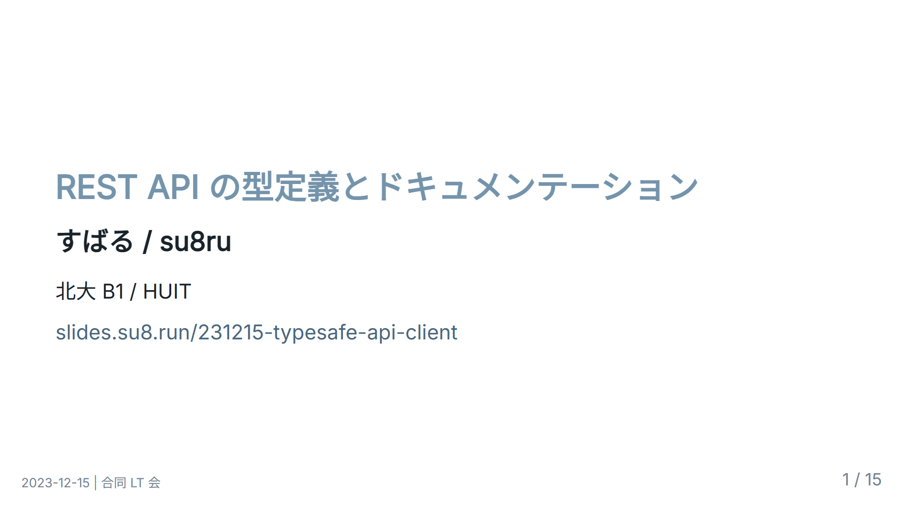
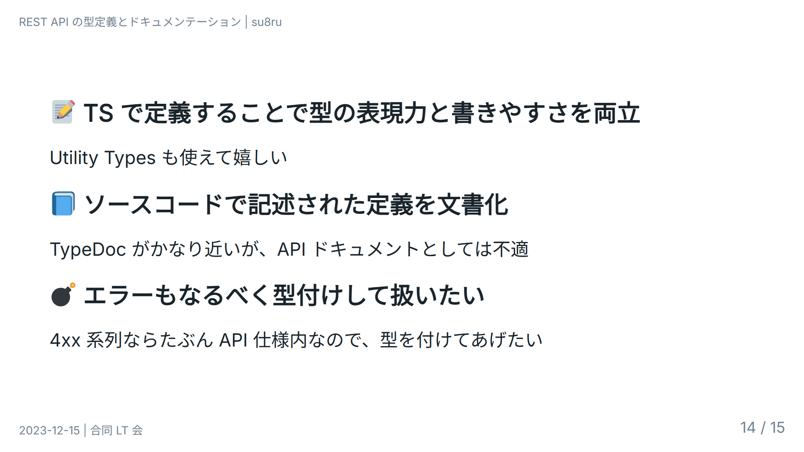
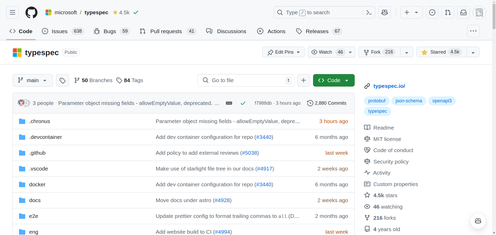
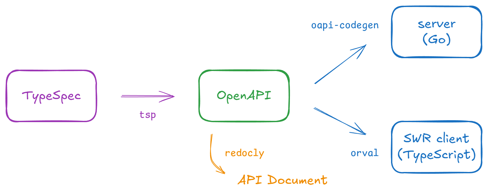
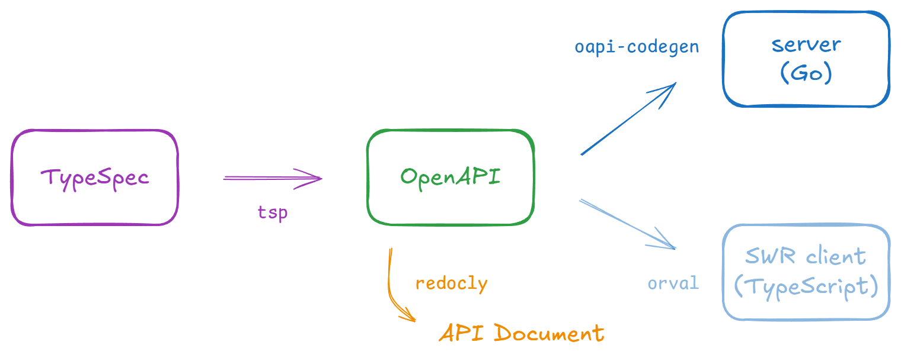
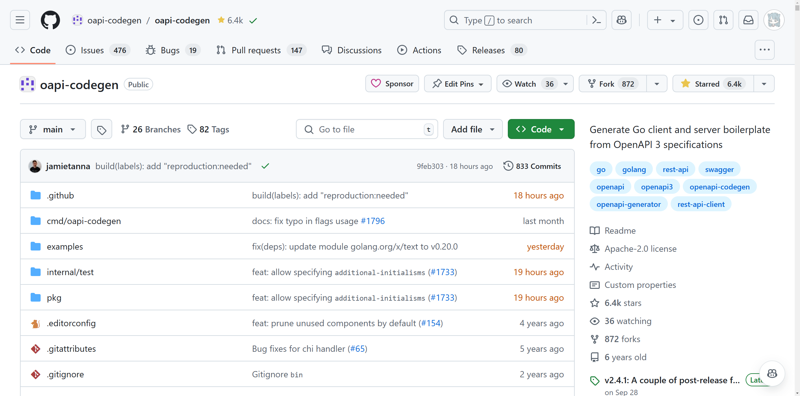
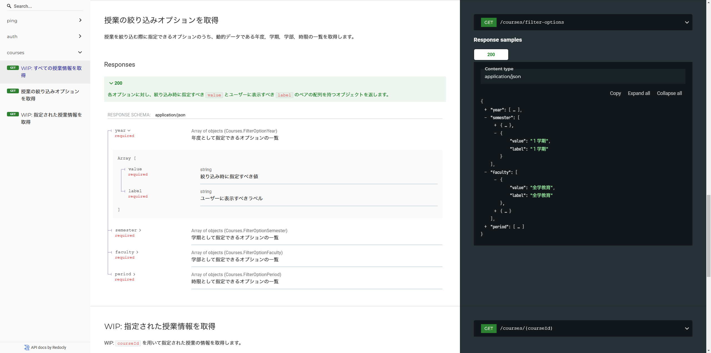
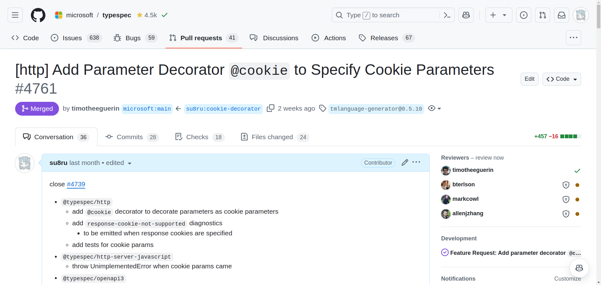

# REST API 型安全を目指して<br />〜スキーマ駆動開発を支える技術〜

<style scoped>
  .profile-icon {
    width: 90px;
    float: left;
    margin-right: 16px;
  }
</style>


### すばる / su8ru

<br />

2024-11-29 | 北大合同勉強会 2025 冬

<https://slides.su8.run/241129-sdd>


---

<!--
header: REST API 型安全を目指して 〜スキーマ駆動開発を支える技術〜 | su8ru
-->

<style scoped>
  .profile-icon {
    width: 400px;
    float: right;
    margin-right: -20px;
    margin-top: -20px;
  }
</style>


# 自己紹介

## すばる / su8ru

- 北海道大学工学部
  情報エレクトロニクス学科 2 年
- **HUIT** / 3D 研 / JagaJaga (Hupass)
- Twitter: [@su8ru\__n_](https://twitter.com/su8ru_n) <- New!!
- GitHub: [@su8ru](https://github.com/su8ru)
- すきなもの：TypeScript / 初音ミク / 鏑木ろこ / ヰ世界情緒
- お仕事でフロントエンドを、趣味でバックエンドを書いています


---

<style scoped>
  section {
    background: #ebf8ff;
  }
</style>


## 北大生による、北大生のための時間割アプリ

---


---

# サーバー実装のフルリプレース

（および iNAZO$^1$ バックエンドの統合）

> > > 1. iNAZO: 成績分布検索サービス。北大が公式で公開している授業ごとの成績分布を検索できる。

---

# 技術スタック

## Python (Django) -> Go (Echo)

> 見通しの効く言語・フレームワークでスキーマ駆動開発をしたい

---

# 課題感

1. Django が複雑でついていけない
   当初バックエンドを開発していた人が卒業してしまった
2. MVT アーキテクチャの学習コストが高い
   学習コストが高く見合わない
3. Python がつらい
   型がない開発はつらい
4. API ドキュメントが存在しない
   現行の API はドキュメントが存在せず、実装を参照していた

---

## 時を戻して昨年末……

---



---

# 当時の概要

- 理想はフルスタック TypeScript だが難しい
  - 現実的には「実装に合わせて型定義を作る」方向で対処する
- OpenAPI はつらい
  - バックエンドから生成するとフロントエンドが遅れる
  - 手書きはとても大変
- API 型定義からリファレンスを生成したい

---



---

# 最強の API 定義用ライブラリを作ろう！

## と、思ったんですが……

---

## もうありました

# その名も「TypeSpec」

---


---



---

# 実際に見てみる

---

```tsp
import "@typespec/http";

using TypeSpec.Http;

model Store {
  name: string;
  address: Address;
}

model Address {
  street: string;
  city: string;
}

@route("/stores")
interface Stores {
  list(@query filter: string): Store[];
  read(@path id: Store): Store;
}
```

---

## これを OpenAPI に変換すると……

```sh
tsp compile .
```

---

<div class="col2">

```yaml
openapi: 3.0.0
info:
  title: (title)
  version: 0.0.0
tags: []
paths:
  /stores:
    get:
      operationId: Stores_list
      parameters:
        - name: filter
          in: query
          required: true
          schema:
            type: string
      responses:
        '200':
          description: The request has succeeded.
          content:
            application/json:
              schema:
                type: array
                items:
                  $ref: '#/components/schemas/Store'
/stores/{id}:
  get:
    operationId: Stores_read
    parameters:
      - name: id
        in: path
        required: true
```

```yaml
        schema:
          $ref: '#/components/schemas/Store'
    responses:
      '200':
        description: The request has succeeded.
        content:
          application/json:
            schema:
              $ref: '#/components/schemas/Store'
components:
  schemas:
    Address:
      type: object
      required:
        - street
        - city
      properties:
        street:
          type: string
        city:
          type: string
    Store:
      type: object
      required:
        - name
        - address
      properties:
        name:
          type: string
        address:
          $ref: '#/components/schemas/Address'
```

</div>

---

## すばらしい :tada:

- TypeScript の書き味で書ける
- OpenAPI 独特の冗長な記法に悪戦苦闘する必要がない

---

## OpenAPI が生成されるとうれしい

1. コードジェネレーターが豊富
   - openapi-ts
   - orval
   - oapi-codegen
2. ドキュメントツールが豊富
   - Swagger UI
   - Redoc

---

## たどり着いた開発体制



<!-- https://excalidraw.com/#json=OukVfJ3x1VDmes534x1CQ,wp4DK6gKWtDzAQGQz5dL6w -->

---

## OpenAPI から client 用コードを生成 <- よくある

- orval
- openapi-ts
- openapi-generator

## OpenAPI から server 用コードを生成 <- あんまり見ない

- openapi-generator (TypeScript)
- ogen (Go)
- oapi-codegen (Go)

---

## 時間もないのでサーバー実装にフォーカス



---

# oapi-codegen

## OpenAPI から Go のインターフェースを生成する

類似ツールも検討 -> 生成されたファイルを編集する必要がない利点から採用

---



---

OpenAPI から

## ハンドラを持つインターフェースが生成される

```go
// ServerInterface represents all server handlers.
type ServerInterface interface {
	// 認可レスポンスを検証してログインを実行
	// (GET /auth/google/callback)
	GoogleCallback(ctx echo.Context, params GoogleCallbackParams) error
	// OIDC 認証を要求
	// (GET /auth/google/login)
	GoogleLogin(ctx echo.Context) error
	// WIP: すべての授業情報を取得
	// (GET /courses)
	CoursesAll(ctx echo.Context) error
```

---

## response の型を強制できる

```go
// StrictServerInterface represents all server handlers.
type StrictServerInterface interface {
	// 認可レスポンスを検証してログインを実行
	// (GET /auth/google/callback)
	GoogleCallback(ctx context.Context, request GoogleCallbackRequestObject)
                                                (GoogleCallbackResponseObject, error)
	// OIDC 認証を要求
	// (GET /auth/google/login)
	GoogleLogin(ctx context.Context, request GoogleLoginRequestObject)
                                                (GoogleLoginResponseObject, error)
	// WIP: すべての授業情報を取得
	// (GET /courses)
	CoursesAll(ctx context.Context, request CoursesAllRequestObject)
                                                (CoursesAllResponseObject, error)
```

---

## router にも登録してくれる（例：Echo）

```go
func RegisterHandlersWithBaseURL(router EchoRouter, si ServerInterface, baseURL string) {

	wrapper := ServerInterfaceWrapper{
		Handler: si,
	}

	router.GET(baseURL+"/auth/google/callback", wrapper.GoogleCallback)
	router.GET(baseURL+"/auth/google/login", wrapper.GoogleLogin)
	router.GET(baseURL+"/courses", wrapper.CoursesAll)
	router.GET(baseURL+"/courses/filter-options", wrapper.CoursesFilterOptions)
	router.GET(baseURL+"/courses/:courseId", wrapper.CoursesGet)
	router.GET(baseURL+"/ping", wrapper.PingGet)

}
```

---

## handler の例

`server/handler/ping.go`

```go
// PingGet - /api/v2/ping
func (s Server) PingGet(_ context.Context, _ openapi.PingGetRequestObject)
                                                (openapi.PingGetResponseObject, error) {
  // do something
	return openapi.PingGet200JSONResponse{
		Ok:   true,
		Pong: time.Now(),
	}, nil
}
```

`PingGet200JSONResponse` の型によってレスポンスの型が強制されている！

---

<div class="col2">
<div>

`server/openapi/server.gen.go`

```go
type PingGet200JSONResponse struct {
	Ok bool `json:"ok"`

	// Pong 現在時刻
	Pong time.Time `json:"pong"`
}
```

</div>
<div>

`api-spec/main.tsp`

```tsp
  @get
  @summary("疎通確認")
  op get(): {
    @statusCode statusCode: 200;
    @body pong: {
      ok: boolean;
      @doc("現在時刻") pong: offsetDateTime;
    };
  };
```

</div>
</div>

---

# デメリット

## エンドポイントごとにミドルウェアの指定ができない

- コード生成された router 登録処理を内部実行しているため
- どうしても必要なら、全エンドポイントに登録して path を見る
- 認証認可には OpenAPI の `auth` ディレクティブに対応した機能がある
  (`github.com/oapi-codegen/echo-middleware`)

---

# メリット

## サーバー実装には API 定義が必要な状況を作れた

必ず API 定義が先行するので、client / server の同時実装も可能

## クライアント・サーバーの型が同じスキーマ由来

API 定義を書いたら自動で型が付くので開発体験が良い

## API ドキュメントができた

Redocly を用いて生成し、Cf Pages にデプロイしています

---



---

# 大変だった

## TypeSpec に parameter を cookie とするデコレータがなかった

`@cookie` デコレータを追加

Discussion -> Issue -> Pull Request と段階を踏んで半月ほどかかった

---



---

# まとめ

- サーバー実装のフルリプレースを期に、スキーマ駆動開発を導入してみた
- API スキーマ由来の型による制約が効くことで開発体験を向上
- **TypeSpec**：TS ライクな記法から OpenAPI を生成してくれて便利
  https://typespec.io
- **oapi-codegen**：OpenAPI から Go のインターフェースを生成してくれる
  GitHub: [oapi-codegen/oapi-codegen](https://github.com/oapi-codegen/oapi-codegen)
- OSS に貢献すると楽しい

ご清聴ありがとうございました :pray:
