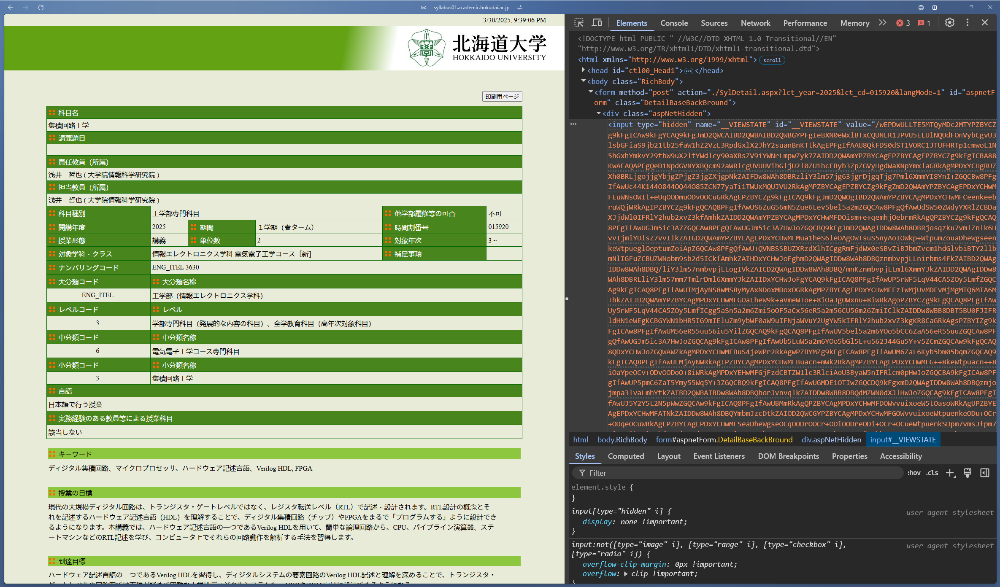
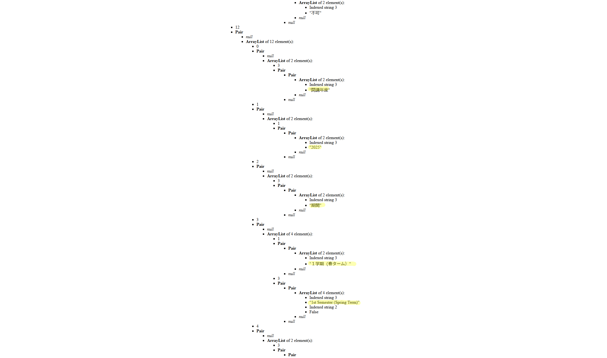

# VIEWSTATE へのインデックスアクセスをやめたい

<style scoped>
  .profile-icon {
    width: 90px;
    float: left;
    margin-right: 16px;
  }
</style>


### すばる / su8ru

<br />

2025-03-30 | 限界 LT #6

<https://slides.su8.run/250330-glt06>

---

<!--
header: VIEWSTATE へのインデックスアクセスをやめたい | su8ru
-->

<style scoped>
  .profile-icon {
    width: 400px;
    float: right;
    margin-right: -20px;
    margin-top: -20px;
  }
</style>


# 自己紹介

## すばる / su8ru

- 北海道大学工学部
  情報エレクトロニクス学科 2 年
- HUIT 部長 / 3D 研 / JagaJaga (Hupass)
- Twitter: [@su8ru\__n_](https://twitter.com/su8ru_n) <- New!!
- GitHub: [@su8ru](https://github.com/su8ru)
- すきなもの：TypeScript / 初音ミク / 鏑木ろこ / ヰ世界情緒
- お仕事でフロントエンドを、趣味でバックエンドを書いています

---

<style scoped>
  section {
    background: #ebf8ff;
  }
</style>


## 北大生による、北大生のための時間割アプリ

---


---


---

## シラバスを検索できる

→ シラバスを取ってくる必要がある

---



---



---

```python
from collections import deque

from viewstate import ViewState

def parse_viewstate(encoded_viewstate):
    vs = ViewState(encoded_viewstate)
    data = vs.decode()

    # TODO: 本当にひどいのでなんとかしたい。。。
    classinfo = data[0][1][1][1][1][1][1][3][1][1][1][1][1]
    baseinfo = classinfo[3][1][1][1][1][1][1][1]

    for i in range(len(baseinfo) // 2):
        if not (baseinfo[2 * i + 1][0] is None) and False in baseinfo[2 * i + 1][0]:
            continue
        arraylist = baseinfo[2 * i + 1][1]

        (略)

    return data
```

---

## VIEWSTATE があまりに曲者

なんですが、使わないといけない理由もある

---

- Hupass では授業の主キーを自分たちで採番している
- スクレイピングごとにシラバス側を正として上書きしている

→ 判別するためのキーとして**時間割番号が必要**！！！

---

## なんですが

---

普通に検索すると時間割番号が出てこない（なんで？？）

---

なので、どうにかうまく付き合う方法を考えながら

インデックスアクセスを続けています

---

おわり
