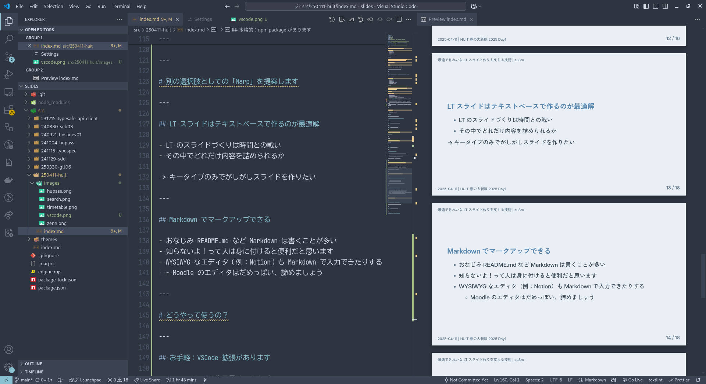

# 爆速できれいな LT スライド作りを支える技術

<style scoped>
  .profile-icon {
    width: 90px;
    float: left;
    margin-right: 16px;
  }
</style>


### すばる / su8ru

<br />

2025-04-11 | HUIT 春の大新歓 2025 Day1

<https://slides.su8.run/250411-huit>

---

<!--
header: 爆速できれいな LT スライド作りを支える技術 | su8ru
-->

<style scoped>
  .profile-icon {
    width: 400px;
    float: right;
    margin-right: -20px;
    margin-top: -20px;
  }
  .profile-icon2 {
    width: 130px;
    position: absolute;
    right: 70px;
    top: 330px;
    border: 10px solid white;
    border-radius: 100%;
  }
</style>


# 自己紹介

## すばる / su8ru

- 北海道大学工学部
  情報エレクトロニクス学科 3 年
- **HUIT 部長** / 3DP 研 / JagaJaga (Hupass)
- Twitter: [@su8ru\__n_](https://twitter.com/su8ru_n) , GitHub: [@su8ru](https://github.com/su8ru)
- すきなもの：TypeScript / ヰ世界情緒 / 鏑木ろこ / 初音ミク
- 仕事でウェブフロントエンドを、趣味でウェブバックエンドを書いています
- ひとこと：MacBook Air M4 を買いました　 Arch/NixOS いままでありがとう

---

<style scoped>
  section {
    background: #ebf8ff;
  }
</style>


## 北大生による、北大生のための時間割アプリ

---


---


---

# 時間割アプリ Hupass、使ってね！

宣伝ここまで

---

今日は

# いまご覧のこのスライド の 作り方 の話

をします

---


---

## 記事読めばよくない？

- アドカレ用に急いで書いたので説明不足な部分が多い
- サークル内への共有向けに書いた記事が思ったよりバズった
  - その効果として、様々な知見が集まった

-> 今日はこの記事 + α の話をします

---

# スライドを作るとき、どのツールを使ってますか？

---

よくある：PowerPoint, Google Slides, Canva, etc...

ちなみにさっきのは Canva でした

---

# 別の選択肢としての「Marp」を提案します

---

## LT スライドはテキストベースで作るのが最適解

- LT のスライドづくりは時間との戦い
- その中でどれだけ内容を詰められるか

-> キータイプのみでがしがしスライドを作りたい

---

## Markdown でマークアップできる

- おなじみ README.md など Markdown は書くことが多い
- 知らないよ！って人は身に付けると便利だと思います
- WYSIWYG なエディタ（例：Notion）も Markdown で入力できたりする
  - Moodle のエディタはだめっぽい、諦めましょう

---

# どうやって使うの？

---

## お手軽：VSCode 拡張があります

このスライドの制作風景はこんな感じ：

---



---

## 本格的：npm package があります

`@marp-team/marp-cli` の `marp` コマンドが使える

細かい導入方法は説明しませんが、気に入ったら導入をおすすめ（めちゃ便利）

---

# テキストベースでうれしいこと

---

## 爆速で作れる！

これはさっきモチベーションとして説明した通り

このスライドを書いているのが当日の 17:40

---

## Git 管理できる！

- 個人的にドキュメント系を Git 管理するのはあまり好きでない
- 複数端末で管理するために GitHub に上げているという消極的な面も
- しかし、GitHub に上げることで得られるメリットもある：

---

## ウェブ上にデプロイできる

- 私は Cloudflare Pages を使っています
- `marp-cli` は HTML + CSS + JS を生成するので、
  これをデプロイしてあげるとスライドをブラウザで見れる
  - <https://slides.su8.run>

---

## スライドを自分でデプロイできるのは大きなメリット

スライドの共有サービスはいろいろある（Speaker Deck, Slide Share, etc...）

しかし、無料枠の縮小など風当たりが厳しい

-> 自分の登壇スライドを資産として自分で公開しておけるメリットは計り知れない

---

# まだできることはたくさんありそう

記事への反響に良さげなアイデアがあった

---

## 現状はユーティリティクラスを自分のテーマに定義している

`.profile-icon` とかでアイコンの位置を調整したり、
`.col2` とかで 2 カラムレイアウトを作れるようにしている

<br />

<div class="col2">

```cpp
using namespace std;
```

```ts
export const Hoge = () => {};
```

</div>

---

## これを Tailwind CSS や UnoCSS みたいなもので代替できないか？

ほんとは実践するところまでやって登壇したかった！！

が、新年度で時間がなく……（言い訳）

試してみたら HUIT の LT 会で発表します

---

# ぜひ一度使ってみてね！

Marp の関係者などではない

---

## 分からないことがあったらぜひ HUIT の Discord で聞いてね

入部しよう！！！！！
