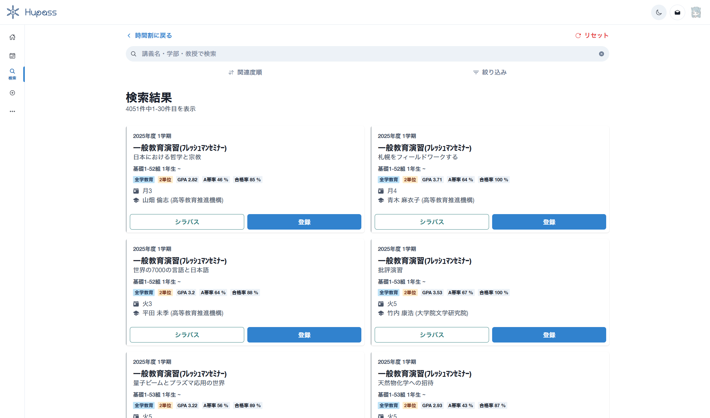
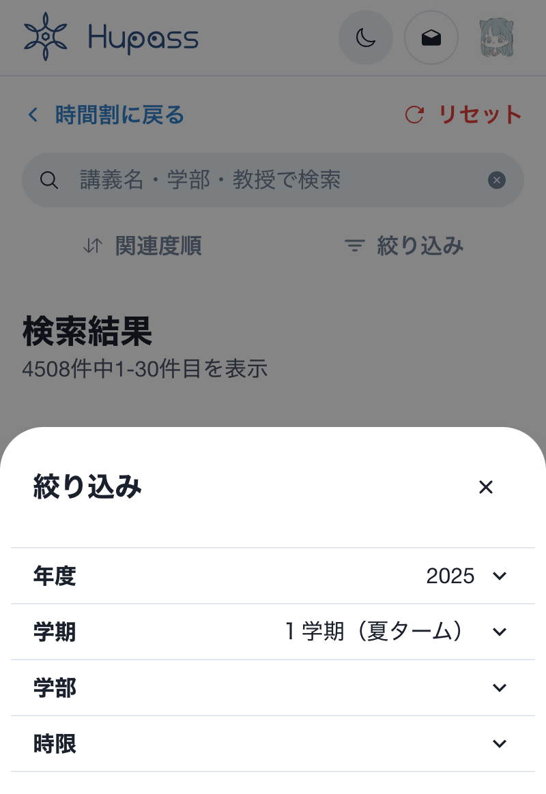
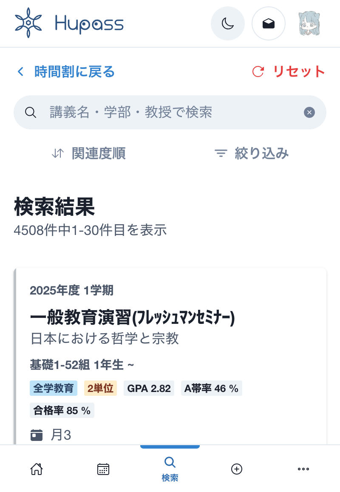

# Hupass の講義検索を Elasticsearch にしたい

<style scoped>
  .profile-icon {
    width: 90px;
    float: left;
    margin-right: 16px;
  }
</style>


### すばる / su8ru

<br />

2025-07-11 | Marp でスライド作成入門

<https://slides.su8.run/250711-huit>

---

<!--
header: Hupass の講義検索を Elasticsearch にしたい | su8ru
-->

<style scoped>
  .profile-icon {
    width: 400px;
    float: right;
    margin-right: -20px;
    margin-top: -20px;
  }
  .profile-icon2 {
    width: 130px;
    position: absolute;
    right: 70px;
    top: 330px;
    border: 10px solid white;
    border-radius: 100%;
  }
</style>


# 自己紹介

## すばる / su8ru

- 北海道大学工学部
  情報エレクトロニクス学科 3 年
- **HUIT 部長** / 3DP 研 / JagaJaga (Hupass)
- Twitter: [@su8ru\__n_](https://twitter.com/su8ru_n) , GitHub: [@su8ru](https://github.com/su8ru)
- すきなもの：TypeScript / ヰ世界情緒 / 鏑木ろこ / ものづくり
- 仕事でウェブフロントエンドを、趣味でウェブバックエンドを書いています
- ひとこと：レポートが終わらない

---

<style scoped>
  section {
    background: #ebf8ff;
  }
</style>


## 北大生による、北大生のための時間割アプリ

---


---



---

# 今日はこの「講義検索」のお話

## 講義検索って複雑なんです

---

## 絞り込み

- 年度（2025 年度，……）
- 学期（１学期（春ターム），通年，……）
- 学部（総合教育部，工学部，……）
- 時限（月１，月２，……）



---

## キーワード検索？

> 講義名・学部・教員名で検索



---

## ユーザーが入力したキーワードが「どれ」に該当するのかわからない

→ すべてに対して検索をするしかない

---

## 全部 OR で繋げて総当たり

```py
q = q.filter(cls_id__isnull=False)  # 時間割IDが存在しない授業は検索にヒットさせない

...

q = q.filter(
    reduce(operator.or_, (Q(subject__contains=term) for term in terms))
    | reduce(operator.or_, (Q(theme__contains=term) for term in terms))
    | reduce(operator.or_, (Q(elig_dep__contains=term) for term in terms))
    | reduce(operator.or_, (Q(sort__name__contains=term) for term in terms))
    | reduce(operator.or_, (Q(teacher__name__contains=term) for term in terms))
    | Q(pk__in=keywords_id)
)
```

---

## カラムごとに優先度を付けてスコアリング

```py
# 関連度でスコア付け

...

Case(
    When(subject__contains=term, then=Value(1000)),
    When(theme__contains=term, then=Value(500)),
    When(elig_dep__contains=term, then=Value(100)),
    When(sort__name__contains=term, then=Value(100)),
    When(teacher__name__contains=term, then=Value(100)),
    When(pk__in=keywords_id, then=Value(10)),
    default=Value(0),
)
for term in terms
```

---

## 重い！！！！

- 新年度始まって数日の日中は検索 API が死んでいた
- これを自分が再実装しても、軽量にできる気がしない

と、いうわけで

---

# Elasticsearch で検索 API をリプレースしたい！

---


---

## なぜ軽くできる？

事前に形態素解析した結果をデータベースに保存しておける！

- これにより、あいまい検索でもインデックスが効く（B-Tree）
- SQL の `LIKE` 検索はインデックスが効かない（全部見る）

…と、わたしは思っている

---

## でっかいデータの全文検索をしてみたい人、お待ちしています


