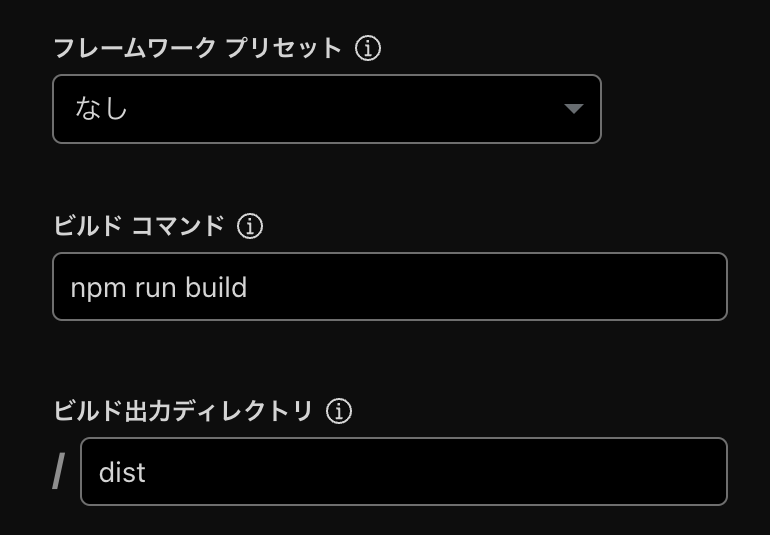

# Git をマスターして Cloudflare にデプロイしよう

<style scoped>
  .profile-icon {
    width: 90px;
    float: left;
    margin-right: 16px;
  }
</style>


### すばる / su8ru

<br />

2025-07-11 | HUIT 通常活動

<https://slides.su8.run/250718-huit-git>

---

# 環境調査

---

## Windows のひと

### WSL が使えるひと

### WSL じゃないひと

## macOS のひと

---

# 今日のアジェンダ

## 1. Git 入門

## 2. GitHub ちょっと触る

## 3. Marp を npm で動かす

## 4. Cloudflare にデプロイする

---

# 1. Git 入門

---

とりあえずターミナルを立ち上げて

```
git --version
```

↓

```
git version 2.50.0
```

みたいなのが出れば OK

---

# とりあえず Git 管理に載せてみよう

---

## 前回のフォルダを開いてください

### 前回のがない人は

いい感じにフォルダを作って VSCode で開いて markdown を 1 ファイル作れば OK

---

## 事前準備

```
zenkaino-dir/
  slide.md
```

↓

```
zenkaino-dir/
  src/
    slide.md
```

---

## git init

↑ いまいるディレクトリを Git リポジトリとして初期化するコマンド

```
git init
```

```
git status
```

---

## git add

### ステージング staging

手元のファイル (untracked，赤色) → `git add <target>` → staging（緑色）

```
git add src
```

---

## git commit

Git が管理しているファイルの「変更状況」を記録するもの

```
git commit -m 'ここがコミットメッセージ'
```

---

## `Author identity unknown` が出た人向け

```
git config --global user.email "me@su8ru.dev"
git config --global user.name "subaru"
```

→ もう一回 git commit

---

## リモートリポジトリを作る

GitHub でがんばる

---

## git remote

```
git remote add <name> <url>
```

```
> git remote show
origin
```

---

## git push

```
git push origin main
```

```
git push origin master
```

---

## 認証の存在を忘れていた :bow: ので認証を通します

https://github.com/cli/cli/blob/trunk/docs/install_linux.md

```
gh auth login
```

---

# marp-cli

---

## Node.js

```
node --version
```

---

## npm init / install

### init

```
npm init -y
```

### marp-cli を入れる

```
npm install @marp-team/marp-cli
```

---

## VSCode で `package.json` を開いて `scripts` を置き換える

```json
  "scripts": {
    "dev": "marp -s . --html",
    "build": "marp"
  },
```

---

## `.marprc` を作る

```
inputDir: ./src
output: ./dist
lang: ja
```

---

# `npm run dev`

---

# Cloudflare

---

## `.gitignore`

忘れてました :bow:

```
dist/
node_modules/
```

---

## そういえばまだ commit していなかった

```
git add .
git commit -m 'npmになったよ'
git push
```

---


