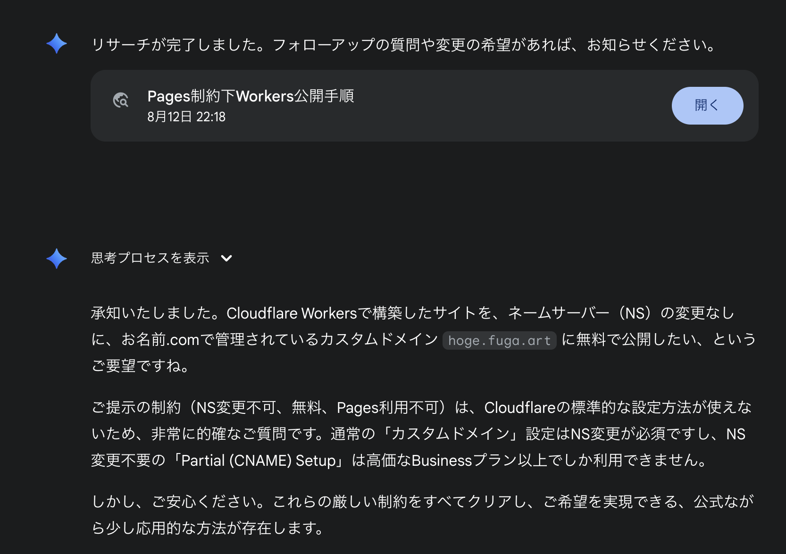
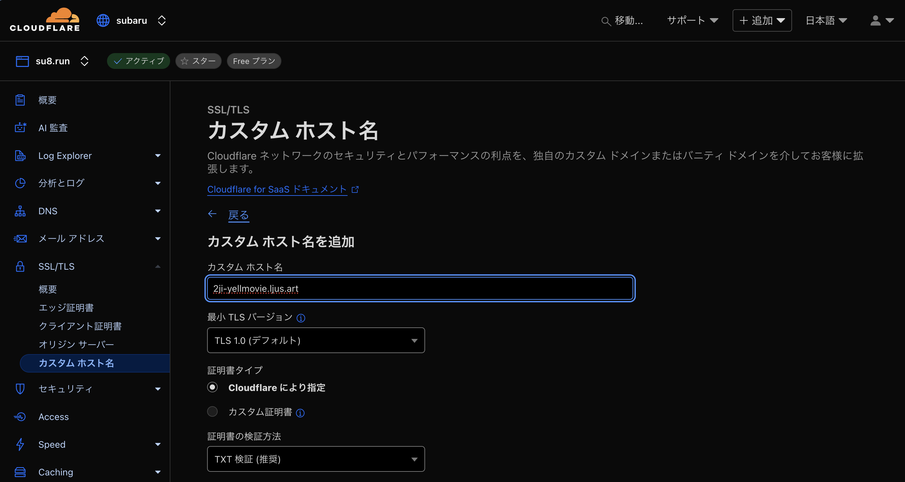
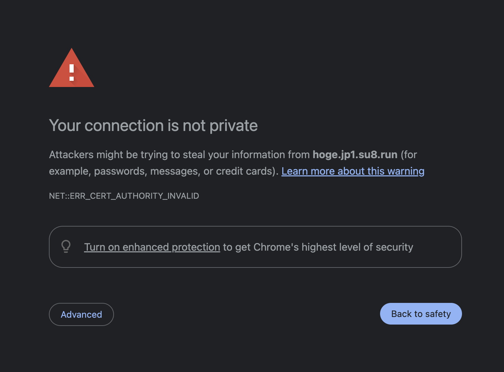
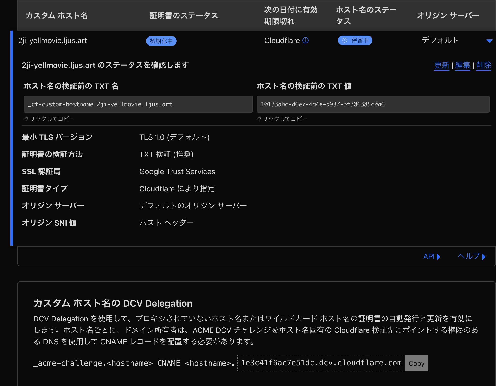

# 二次創作合同誌の広報 LP を作ったはなし

<style scoped>
  .profile-icon {
    width: 90px;
    float: left;
    margin-right: 16px;
    mix-blend-mode: multiply;
  }
</style>


### すばる / su8ru

<br />

2025-08-29 | LT 会 in 公立千歳科学技術大学 #しすかん

https://slides.su8.run/250829-cist

---

<!--
header: 二次創作合同誌の広報 LP を作ったはなし | su8ru
-->

<style scoped>
  .profile-icon {
    width: 400px;
    position: absolute;
    right: 70px;
    top: 40px;
    mix-blend-mode: multiply;
  }
  .profile-icon2 {
    width: 200px;
    position: absolute;
    right: 20px;
    top: 330px;
    /* border: 10px solid white; */
    /* border-radius: 100%; */
  }
  .suki {
    display: inline;
    height: 64px;
    margin-left: 8px;
    margin-bottom: -32px;
  }
</style>


# 自己紹介

## すばる / su8ru

- 北海道大学工学部情エレ 3 年
- **HUIT 部長** / 3DP 研 / JagaJaga (Hupass)
- Twitter: [@su8ru\__n_](https://twitter.com/su8ru_n) , GitHub: [@su8ru](https://github.com/su8ru)
- 最近呼んでる本：SQL アンチパターン 第 2 版
- すきなもの：TypeScript / ヰ世界情緒 / 藤田ことね / 鏑木ろこ / ドライブ
- 仕事でウェブフロントエンドを、趣味でウェブバックエンドを書いています
- ひとこと：仕事でずっと携わってた BIG 機能が一昨日リリース :tada: 

---

# 自己紹介（サークル編）


## 北大 IT 研究会 ( HUIT )

- 北海道大学の学生を中心としたインカレ
- 普段は Discord でおしゃべりしたり、
  金曜日に大学近くで集まって勉強会とか
- たまに札幌の企業さんと一緒に
  大きめの勉強会・LT 会をやったり
- 他大学のサークル事情に興味があって
  札幌からみんなでやって来ました

---

# おねがい

## 先方がいるお話なので、スライドの撮影は NG とさせてください :pray:

---

# 二次創作合同誌の広報 LP を作ったはなし

## 数ページのエールを Ⅱ

https://2ji-yellmovie.ljus.art/

---

# 制作チーム

## 広報統括・広報デザイン

- 涼夏

## web 実装

- りんたろー
- すばる
- しゅん
- ろきし

---

# 技術スタック

- フレームワーク：Astro + Preact
- CSS フレームワーク：Charcoal UI × Tailwind CSS
- アニメーション：Anime.js
- CMS：Notion

---

View Transitions API とか Notion as CMS とかいろいろおもしろいんですが……

---

今回は

# デプロイ

のお話をします

---

## デプロイ先を考える

新たにドメインを取ると管理が浮いてしまう懸念があるため、
先方のサークル用ドメインのサブドメインにデプロイしたい

---

## Workers に割り当てられるのは Cf で管理しているドメインのみ

- 先方のドメインは某 お ●●.com で管理されていた
- これだけのために Cf に NS 移譲してもらうのは申し訳ない

---

## 途方に暮れたので Gemini に投げた

> これらの厳しい制約をすべてクリアし、ご希望を実現できる、公式ながら少し応用的な方法が存在します。

頼もしい…！



---



---

# これはなに？

---

## CNAME がすべてを解決してくれる

```
2ji-yellmovie.ljus.art --(CNAME)-> 2ji-yellmovie.su8.run --(Cloudflare)-> Workers
```

---

## と思いきや

---



---

## 問題がある

TLS 証明書をどうやって発行するのか

現代において TLS はほぼ人権なので、TLS 証明書がないのは許されない

が、page.ljus.art は Cloudflare が管理するドメインではない……

---

## 通常の発行フロー

su8ru > `page.su8.run` をホストするから TLS 証明書お願いね

Cloudflare > @認証局 `page.su8.run` の認証をお願いします

認証局 > この TXT レコードを設定して、あなたがドメインの所有者って証明してね

Cloudflare > ネームサーバーは自分なので、この TXT レコードを返せばいいのね

認証局 > よさそう！合格！

---

## 今回

su8ru > `page.ljus.art` をホストするから TLS 証明書お願いね

Cloudflare > @認証局 `page.ljus.art` の認証をお願いします

認証局 > この TXT レコードを設定して、あなたがドメインの所有者って証明してね

Cloudflare > 自分がネームサーバーじゃないから設定できない…… :cry:

認証局 > ほんとにドメインの所有者なの？ :angry:

---

> この TXT レコードを設定して、あなたがドメインの所有者って証明してね

## ここを人間がやればよさそう！

---



---

su8ru > `page.ljus.art` を **CNAME でプロキシ**するから TLS 証明書お願いね

Cloudflare > @認証局 `page.ljus.art` の認証をお願いします

認証局 > この TXT レコードを設定して、あなたがドメインの所有者って証明してね

Cloudflare > @su8ru この TXT レコードを設定してください

su8ru > @先方 お手数ですがこちらの TXT レコードを設定していただけますか :pray:

先方 > （お名前.com Navi と格闘）

認証局 > Cloudflare に指定した TXT レコードが返ってきた！よさそう！合格！

---

# めでたし

---

# 宣伝

---


---

# ご清聴ありがとうございました！
