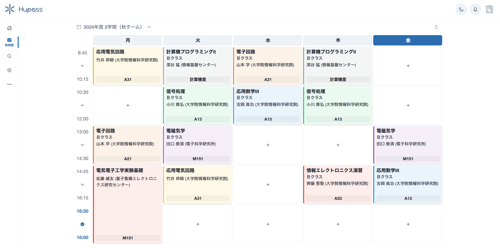

# レガシーバックエンドを<br>API スキーマ駆動開発で再構築する

<style scoped>
  .profile-icon {
    width: 90px;
    float: left;
    margin-right: 16px;
    mix-blend-mode: multiply;
  }
</style>


### すばる / su8ru

<br />

2025-09-02 | 札幌 IT 石狩鍋 #3 - #it_ishikari

https://s.su8.run/250902-ishikari

---

<!--
header: レガシーバックエンドを API スキーマ駆動開発で再構築する | su8ru
-->

<style scoped>
  .profile-icon {
    width: 400px;
    position: absolute;
    right: 70px;
    top: 40px;
    mix-blend-mode: multiply;
  }
  .profile-icon2 {
    width: 200px;
    position: absolute;
    right: 20px;
    top: 330px;
    /* border: 10px solid white; */
    /* border-radius: 100%; */
  }
  .suki {
    display: inline;
    height: 64px;
    margin-left: 8px;
    margin-bottom: -32px;
  }
</style>


# 自己紹介

## すばる / su8ru

- 北海道大学工学部情エレ 3 年
- HUIT 部長 / 3DP 研 / JagaJaga (Hupass)
- Twitter: [@su8ru\__n_](https://twitter.com/su8ru_n) , GitHub: [@su8ru](https://github.com/su8ru)
- 最近呼んでる本：SQL アンチパターン 第 2 版
- すきなもの：TypeScript / ヰ世界情緒 / 藤田ことね / 鏑木ろこ / ドライブ
- 仕事でウェブフロントエンドを、趣味でウェブバックエンドを書いています
- ひとこと：仕事でずっと携わってた BIG 機能がリリース :tada: 

---

<style scoped>
  section {
    background: #ebf8ff;
  }
</style>


## 北大生による、北大生のための時間割アプリ

---



---


---

# Hupass のこれまで

---

## 2023/3 - Hupass リリース

【メイカー特集 #1】北大生のために開発された北大生向け時間割サービス「Hupass」とは — 未完 Foundation | 一般社団法人未完
https://mikan-foundation.org/2023/04/makers-1/


---

## 2023/8 - 突然のサービス長期停止

当時の人々のツイート

> ちょっと前くらいから hupass が読み込めないけど、環境のおはなしなのかな

> HUpass 使えない

> HUpass 使えないからシラバスで頑張って探すしかない。

> Hupass 封印されてるのふつーにつらい

> 来年には Hupass が死語になってる説

### Q. iNAZO や JagaJaga は生きてる。じゃあなんで落ちてるんだ…？

---

## Hupass なしで新学期を迎えるなんて考えられない！


### → ぜひ協力してくれないかとのお返事

---

### A. 諸事情によりサーバーがストップしたあと、立ち上がらなくなった

当時の開発メンバーは学部 4 年生 x 2

夏休みも研究で忙しく、Hupass の復旧作業をしている余裕がなかった

#### → 開発体制の刷新と安定を目指すことに

---

## 2023/9 - 後期滑り込み復旧


---

## 残されたのは：レガシーコードたっぷりのバックエンド

ここでいうレガシーコードとは、「先輩がプログラミング入門した Django」

具体的には……

---

## ここがつらいよ

- **API ドキュメントがない**
- Python なので型がない
- **モデル設計がびみょい**
- `null` の代わりに数値 `-1` が使われている

### → バックエンドをフルリプレースしたい！

---

# Go の強力なコード生成を信じてスキーマ駆動開発

---

## アーキテクチャの全体像


---

## OpenAPI から client 用コードを生成 <- よくある

- orval
- openapi-ts
- openapi-generator

## OpenAPI から server 用コードを生成 <- あんまり見ない

- openapi-generator (TypeScript)
- ogen (Go)
- oapi-codegen (Go)

---

# oapi-codegen

## OpenAPI から Go のインターフェースを生成する

類似ツールも検討 -> 生成されたファイルを編集する必要がない利点から採用

https://github.com/oapi-codegen/oapi-codegen

---

## Strict Server を使うと堅牢な開発ができる

---


---

## バックエンドの「型制約」


---

## HTTP path と Handler 実装との紐づけがコード生成により自動化

```go
// ServerInterface represents all server handlers.
type ServerInterface interface {
  // 認可レスポンスを検証してログインを実行
  // (GET /auth/google/callback)
  GoogleCallback(ctx echo.Context, params GoogleCallbackParams) error
  // OIDC 認証を要求
  // (GET /auth/google/login)
  GoogleLogin(ctx echo.Context) error
  // ログアウト
  // (POST /auth/logout)
  AuthLogout(ctx echo.Context, params AuthLogoutParams) error
  // すべての授業情報を取得
  // (GET /courses)
  CoursesAll(ctx echo.Context) error
```

---

## HTTP path と Handler 実装との紐づけがコード生成により自動化

```go
// Registers handlers, and prepends BaseURL to the paths, so that the paths
// can be served under a prefix.
func RegisterHandlersWithBaseURL(router EchoRouter, si ServerInterface, baseURL string) {

  wrapper := ServerInterfaceWrapper{
    Handler: si,
  }

  router.GET(baseURL+"/auth/google/callback", wrapper.GoogleCallback)
  router.GET(baseURL+"/auth/google/login", wrapper.GoogleLogin)
  router.POST(baseURL+"/auth/logout", wrapper.AuthLogout)
  router.GET(baseURL+"/courses", wrapper.CoursesAll)
  router.GET(baseURL+"/courses/filter-options", wrapper.CoursesFilterOptions)
  router.GET(baseURL+"/courses/:courseId", wrapper.CoursesGet)
```

---

## Handler が受け取る・返す型もコード生成

```go
type GoogleLogin307ResponseHeaders struct {
  Location  string
  SetCookie string
}

type GoogleLogin307Response struct {
  Headers GoogleLogin307ResponseHeaders
}

type CoursesAll200JSONResponse struct {
  Courses []Course `json:"courses"`
}

type CoursesAll400JSONResponse ErrorBadRequest
```

---

## 実装例

```go
func (s Server) CoursesGet(
  _ context.Context,
  req openapi.CoursesGetRequestObject
) (openapi.CoursesGetResponseObject, error) {
  courseID, err := uuid.Parse(req.CourseId)
  if err != nil {  return nil, err  }

  course, err := s.db.GetCourseByID(courseID)
  if err != nil {  return openapi.CoursesGet404JSONResponse{}, err  }

  apiCourse, err := s.db.ToAPICourse(course)
  if err != nil {  return nil, err  }

  return openapi.CoursesGet200JSONResponse{Course: apiCourse}, nil
}
```

---

# API 定義をスキーマ駆動にできた！次は…？

---

# ORM をスキーマ駆動にしたい！

---

## いま採用しているのは GORM

- GORM はリフレクションによって実行時に構造体を作る
  - 静的型解析が効かない
  - ランタイムに影響がある

---

## Go なら、コード生成で型安全な ORM があるのでは？

---

## ありました

---

# Atlas と Ent でマイグレーション管理・型安全 ORM

---

## Go でスキーマを記述すると、型安全な ORM ができる（うれしい）

<div class="col2">

```go
// User holds the schema definition for the User entity.
type User struct {
  ent.Schema
}

// Fields of the User.
func (User) Fields() []ent.Field {
  return []ent.Field{
    // id of user (UUID v4 or v7)
    field.UUID("id", uuid.UUID{}).Unique(),
    // subject from OIDC
    field.String("sub").Nillable().Unique(),
    // email from OIDC
    field.String("email"),
    // name from OIDC
    field.String("name"),
    // picture from OIDC
    field.String("picture").Nillable(),

    field.Time("created_at").Default(time.Now),
    field.Time("updated_at").Default(time.Now).UpdateDefault(time.Now),
  }
}
```

```go
// Edges of the User.
func (User) Edges() []ent.Edge {
	return []ent.Edge{
		edge.To("sessions", Session.Type),
	}
}

// Indexes of the User.
func (User) Indexes() []ent.Index {
	return []ent.Index{
		index.Fields("id"),
		index.Fields("sub"),
		index.Fields("id", "sub").Unique(),
	}
}
```

</div>

---

# 余談：TypeSpec も発展途上

---

- 10/15 TypeSpec で Cookie をパラメータにできないことに気づく
  → Discussion で質問
- 10/15 「typespec/http ライブラリの "gap" だと思うよ」
  「気軽に feature request 立ててね」
  → Issue を立てる
- 10/16 なんかあんまりすぐ動く気配がない & すぐにほしい！
  → PR を立てる
- 10/17 Reviewer から最初のリアクションがくる
- 〜 指摘されたり考えたり 〜
- 11/1 Approve !!
- 11/2 Merged !!

---


---

## 指摘されたり考えたり？

---

## response で `@cookie` を指定されたときの挙動

パラメータではなく一般のプロパティにすることにした
（他の `@path` や `@query` と同様の挙動）

→ reviewer「将来的に `Set-Cookie` をサポートしたとき破壊的変更になるのでは？」

→ diagnostics（診断）を追加しそれを返すようにした（大変だった……）

---


---

# ご清聴ありがとうございました！
