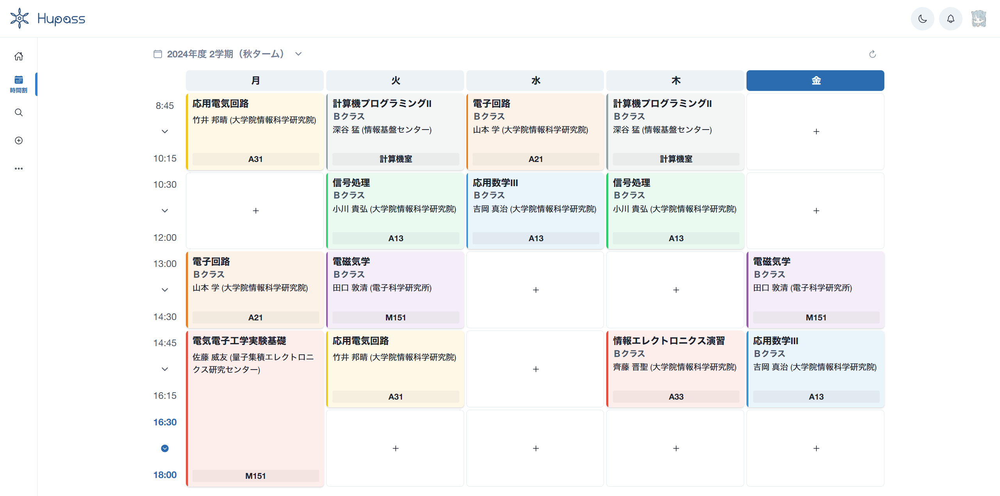
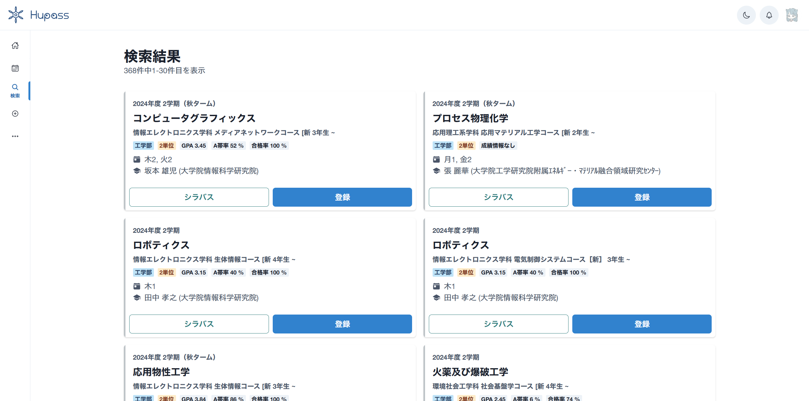
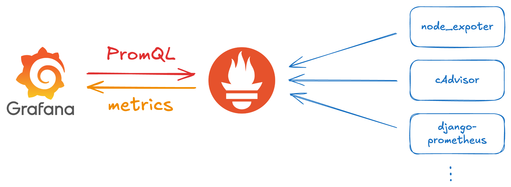

# Grafana でメトリクスを可視化すると楽しい

### すばる / su8ru

 

2025-09-23 | 函館本線沿線勉強会 @小樽 3 号車 - #HNSAdev

https://s.su8.run/250923-hnsadev03

---

<!--
header: Grafana でメトリクスを可視化すると楽しい | su8ru
-->

# 自己紹介

## すばる / su8ru

- 北海道大学工学部情エレ 3 年
- 最寄り駅：~~北 12 条駅~~ **札幌駅**
- HUIT 部長 / 3DP 研 / JagaJaga (Hupass)
- Twitter: [@su8ru\__n_](https://twitter.com/su8ru_n) , GitHub: [@su8ru](https://github.com/su8ru)
- 最近呼んでる本：成瀬允宣, ドメイン駆動設計入門, 翔泳社, 2020
- すきなもの：TypeScript / ヰ世界情緒 / 藤田ことね / 鏑木ろこ / ドライブ
- 仕事でウェブフロントエンドを、趣味でウェブバックエンドを書いています

---

# 近況

- 夏休みが終わりかけていることに絶望しています
- フロントエンドカンファレンス東京に行ってきました
- 東京に行ったついでに出社したら怖がられました

---

## 北大生による、北大生のための時間割アプリ

---

---

---

# バックエンドをフルリプレースしている

先輩が初めて作った Django アプリケーションを Go (Echo) で置き換える

---

# 新システムのアーキテクチャ設計や要件定義

- 現在のシステムはどう動いているのか
- ユーザーがどう使っているのか

を根拠として意思決定する必要がある

---

## 現状の Hupass ではほとんどなにもわからない

→ リプレースと並行して、既存環境のメトリクスを取ることに

---

## Grafana と Prometheus

とにかく早くメトリクスを取りたいので、個人で使っている構成を流用

---

## とりあえず入れてみた exporter

- node_exporter：CPU とかメモリとか
- cAdvisor：Docker / k8s 周り
- django-prometheus：View ごとの値とか

---

# Prometheus を覗いてみよう

---

## 人間にはちょっと難しい

# そこで Grafana が活躍

---

# まとめ：メトリクスの可視化、楽しい！

開発もやらないと……
