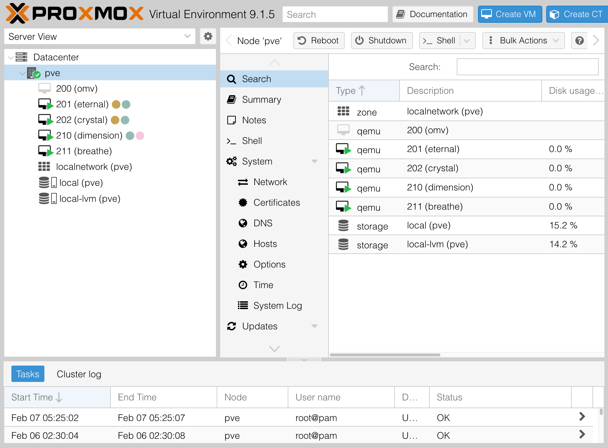

# 自宅の NAS を Proxmox にした

<style scoped>
  .profile-icon {
    width: 90px;
    float: left;
    margin-right: 16px;
    mix-blend-mode: multiply;
  }
</style>


### すばる / su8ru

<br />

2026-02-07 | 【学生向け】冬の３大学合同 LT 会 in 札幌

https://s.su8.run/260207-3univ

---

<!--
header: 2026-02-07 | 【学生向け】冬の３大学合同 LT 会 in 札幌
-->

<style scoped>
  .profile-icon {
    width: 400px;
    position: absolute;
    right: 70px;
    top: 40px;
    mix-blend-mode: multiply;
  }
  .profile-icon2 {
    width: 200px;
    position: absolute;
    right: 20px;
    top: 330px;
    /* border: 10px solid white; */
    /* border-radius: 100%; */
  }
  .suki {
    display: inline;
    height: 64px;
    margin-left: 8px;
    margin-bottom: -32px;
  }
</style>


# 自己紹介

## すばる / su8ru

- 北海道大学工学部情エレ 3 年
- HUIT <small>まだ</small>部長 / 3DP 研 / JagaJaga (Hupass)
- Twitter: [@su8ru\__n_](https://twitter.com/su8ru_n) , GitHub: [@su8ru](https://github.com/su8ru)
- すきなもの：TypeScript / ヰ世界情緒 / 藤田ことね / 鏑木ろこ / ドライブ
- 仕事でウェブフロントエンドを、趣味でウェブバックエンドを書いています

---

# タイトル

<style scoped>
  code {
    font-size: 1.5em;
  }
</style>

```diff
- su8ru「NAS を Proxmox + openmediavault にした（これからする）」
+ su8ru「自宅の NAS を Proxmox にした」
```

---

## 真相：openmediavault を入れてみたけどやめた

---

> openmediavault is the next generation network attached storage (NAS) solution based on Debian Linux. It contains services like SSH, (S)FTP, SMB/CIFS, RSync and many more ready to use.

[openmediavault - DATA SOVEREIGNTY MADE EASY](https://www.openmediavault.org/)

---

# なんで？

---

## Samba って難しい

> Samba （サンバ） は、**マイクロソフトのWindowsネットワークを実装した自由ソフトウェア**。 Linux、Solaris、BSD、macOSなどのUnix系オペレーティングシステム (OS) を用いて、Windowsのファイルサーバやプリントサービス、ドメインコントローラ機能、ドメイン参加機能を提供する。

[Samba - Wikipedia](https://ja.wikipedia.org/wiki/Samba)

---

## これが

```
Linux ACL <-[読み替え]-> Samba ACL <-[読み替え]-> Linux ACL
```

---

## こうなる

```
                    openmediavault ACL
                            ↑
                        [読み替え]
                            ↓
Linux ACL <-[読み替え]-> Samba ACL <-[読み替え]-> Linux ACL
```

---

# できたもの

---



---

# うれしいところ

---

## VM ごとに用途を決めて立てて別 IP を振れる

これまではすべてが NAS と共存

-> 変にネットワーク構成とかをぶっ壊すと NAS にアクセスできなくなって生活が死ぬ

---

## 得体の知れないインストールスクリプトを気軽に走らせられる

**前提：走らせるインストールスクリプトはちゃんと確認しましょう**

最近 Ubiquiti のエンタープライズ Wi-Fi AP をもらった

-> 管理に UniFi Network Application みたいなのが必要だけどインストール怖い！
