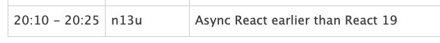

# こんにちは useTransition

<style scoped>
  .profile-icon {
    width: 90px;
    float: left;
    margin-right: 16px;
    mix-blend-mode: multiply;
  }
</style>


### すばる / su8ru

<br />

2026-04-08 | React.study vol.01@sapporo #hokkaido_js

<https://s.su8.run/260408-react-study>

---

<!--
header: こんにちは useTransition | su8ru
-->

<style scoped>
  .profile-icon {
    width: 400px;
    position: absolute;
    right: 70px;
    top: 40px;
    mix-blend-mode: multiply;
  }
  .profile-icon2 {
    width: 200px;
    position: absolute;
    right: 20px;
    top: 330px;
  }
  .suki {
    display: inline;
    height: 64px;
    margin-left: 8px;
    margin-bottom: -32px;
  }
</style>


# 自己紹介

## すばる / su8ru

- 北海道大学工学部情エレ 4 年
- サークル: HUIT ex-部長 / Hupass
- Twitter: [@su8ru\__n_](https://twitter.com/su8ru_n) , GitHub: [@su8ru](https://github.com/su8ru)
- すきなもの：TypeScript / ヰ世界情緒 / 藤田ことね / 鏑木ろこ / ドライブ
- ずっとお手伝いしてたゲームが世に出てはぴ
- 27卒として内定を承諾しました！ :tada: （来春から社会人！？）

---

## 被ったらごめんなさい

↓ を見て着想したけど、めっちゃ初歩なので大丈夫と信じたい



---

# いまってもう React 19 なんですね

---

## 一番書いてた React

```json
    "react": "^17.0.2",
    "react-dom": "^17.0.2",
```

-> 最初に見たもの == 親 == React 16

---

# useTransition ってなに？

---


---

## 上側

- キーワード入力
- ドロップダウンセレクタ

## 下側

- 上側で設定した検索設定で **API を叩いた結果**

---

## 解決したい課題

# 入力操作は同期的に、検索 API は非同期に扱いたい

---

## ユーザーが検索条件を変えると

1. ユーザーの入力をフォームに反映する
   - これを爆速でやってほしい
2. フォームの値を URL に反映する
   - something 重たい処理
3. URL Search Params から値を取ってきて Query Key が変わる
4. 再フェッチ
5. 授業カードに結果を反映

---

## something 重たい処理まで一気にやると（ブラウザが）大変

-> 入力が反映されるのが遅くなる！

---

# そこで useTransition

---

## useTransition

> useTransition は、UI を部分的にバックグラウンドでレンダーするための React フックです。

```ts
const [isPending, startTransition] = useTransition();
```

<https://ja.react.dev/reference/react/useTransition>

---

## handleChange で

```tsx
const handleChange = (v: SomeValue) => {
  setState(v);
  startTransition(() => {
    navigate(...); // ほんとは非同期なんですが同期ってことで
  });
};
```

-> navigate の完了を待たず setState できる！

---

# まとめ

- useTransition を使うと、ブロッキングな処理を後回しにできる
- isPending を使うと、ローディング状態をコンポーネントに反映できる
  - `setLoading(true)` とか
  - `.finally(() => { setLoading(false) })` とか
  - しなくていい！
- 次回予告：React Suspense
